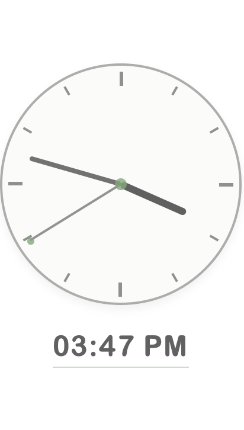
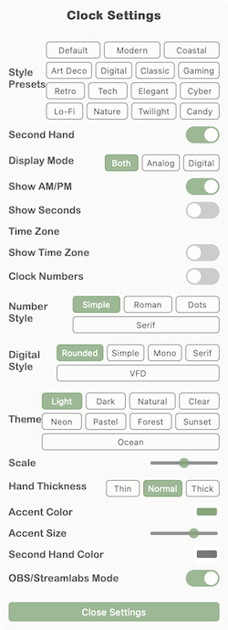

# Minimal Clock Overlay for OBS

A lightweight, customizable clock overlay for OBS. Perfect for streamers who want to display the time without distracting from their content.

[Click here](https://detekoi.github.io/minimal-clock-overlay/clock-overlay.html) for a live demo!

## Features

- **Flexible Display**: Choose to show analog clock, digital time, or both.
- **Customizable**: Multiple appearance options including:
  - Nine beautiful themes: Light, Dark, Natural, Transparent, Neon, Pastel, Forest, Sunset, and Ocean.
  - Fifteen pre-defined style presets (Modern, Cyberpunk, Lo-Fi, Nature, and more).
  - Toggle for clock numbers (Arabic or Roman numerals).
  - AM/PM or 24-hour time format.
  - Customizable font styles for digital clock, date, and time zone (including serif and LCD display).
  - Color and size customization.
- **Date & Time Zone Support**: Display date and time zone with customizable styles.
- **Scene Manager**: Create and manage multiple clock configurations for different scenes.
- **OBS/Streamlabs Compatibility**: Built-in compatibility mode for browser sources with dropdown issues.
- **Draggable**: Position anywhere on your stream.
- **Low Resource Usage**: Optimized for minimal CPU usage.
- **OBS Integration**: Works perfectly as a Browser Source.

## Installation

### Using GitHub Pages (Easy Online Method)
The easiest way to use this clock overlay is with the online version.
1. Visit the [Clock Scene Manager](https://detekoi.github.io/minimal-clock-overlay/scene-manager.html).
2. Create a new clock scene with a meaningful name (e.g., "Gaming Scene Clock").
3. Copy the generated URL.
4. In OBS Studio or StreamLabs Desktop, add a new "Browser Source".
5. Set the width and height to appropriate values (recommended: 300x300).
6. Paste the URL in the URL field.
7. Check "Refresh browser when scene becomes active" (optional).

### Downloading from GitHub (Offline Method)
If you prefer to host the files locally.
1. Click the green "Code" button near the top of the page.
2. Select "Download ZIP" from the dropdown menu.
3. Extract the ZIP file to a location on your computer.
4. Open `scene-manager.html` in your browser to access the Clock Scene Manager.
5. Follow the steps to create and use clock scenes as described above.

### Direct Installation (Legacy Method)
1. After downloading the files, open OBS Studio.
2. Add a new "Browser Source".
3. Set the width and height to appropriate values (recommended: 300x300).
4. Check "Local file" and browse to select the `clock-overlay.html` file.
5. Check "Refresh browser when scene becomes active" (optional).

### Advanced: Manual URL Parameters
If you prefer to manage your clock scenes manually, you can use URL parameters.

Add the `?scene=NAME` parameter to the URL.
- Online example: `https://detekoi.github.io/minimal-clock-overlay/clock-overlay.html?scene=gaming`.
- Windows example: `file:///C:/path/to/clock-overlay.html?scene=gaming`.
- macOS example: `file:///Users/username/path/to/clock-overlay.html?scene=chatting`.

Each scene maintains its own separate settings with unique styling.

Use descriptive scene names like:
- `?scene=gaming` for your gaming scene.
- `?scene=talking` for your talking/webcam scene.
- `?scene=intro` for your stream intro scene.

## Usage

- **Moving the Clock**: Click and drag the clock face to reposition.
- **Accessing Settings**: Hover over the clock and click the gear icon.
- **Closing Settings**: Click the "Close Settings" button or click away.

## Customization Options

- **Second Hand**: Toggle visibility of the second hand.
- **Display Mode**: Choose between analog clock, digital time, or both.
- **AM/PM Display**: Switch between 12-hour (with AM/PM) and 24-hour format.
- **Display Seconds**: Toggle seconds in the digital time display.
- **Time Zone**: Select from multiple time zones around the world.
- **Show Time Zone**: Display the name of the selected time zone below the clock.
- **Time Zone Style**: Choose from different font styles (rounded, simple, monospace, serif, LCD).
- **Show Date**: Toggle the display of the current date.
- **Date Style**: Choose from different font styles (rounded, simple, monospace, serif, LCD).
- **Clock Numbers**: Show or hide hour numbers on the clock face.
- **Number Style**: Choose between simple numbers, Roman numerals, dots, or serif.
- **Digital Style**: Different font options including rounded, simple, monospace, serif, and LCD display.
- **Theme**: Choose from nine themes:
  - Light: Clean white background with dark elements.
  - Dark: Dark background with light elements.
  - Natural: Warm beige tones with brown accents.
  - Transparent: No background, perfect for overlaying on stream content.
  - Neon: Cyberpunk-inspired with bright cyan and magenta.
  - Pastel: Soft lavender and pink hues.
  - Forest: Natural greens with earthy orange accents.
  - Sunset: Dark night sky with sunset orange and pink accents.
  - Ocean: Calming blue tones with aqua accents.
- **Scale**: Adjust the overall size of the clock.
- **Hand Thickness**: Choose between thin, normal, or thick clock hands.
- **Accent Color**: Customize the accent color used for highlights.
- **Accent Size**: Adjust the size of accent elements (center dot, second hand tip) or hide completely.
- **Second Hand Color**: Set a custom color for the second hand.
- **Clock Face Color**: Customize the color of the clock face background.
- **Background Opacity**: Adjust the transparency level of the clock face background.
- **OBS/Streamlabs Mode**: Toggle compatibility mode for browser sources with dropdown issues.
- **Style Presets**: Choose from predefined style combinations:
  - Modern Minimal: Clean, minimalist design with blue accents.
  - Coastal Calm: Soothing blue and teal color scheme.
  - Art Deco: Elegant gold and black design.
  - Digital Display: LCD digital-only display with a tech feel.
  - Traditional: Classic Roman numeral clock with natural wood tones.
  - Gaming HUD: Transparent clock with gaming-inspired neon colors.
  - Retro Vibe: Warm oranges with thicker hands for a vintage feel.
  - Dark Tech: Modern dark theme with dot markers and purple accents.
  - Elegant Serif: Roman numerals with thin hands for a sophisticated look.
  - Cyberpunk: Futuristic neon design with bright magenta and green.
  - Lo-Fi: Muted purple and teal tones with monospace fonts for a relaxed aesthetic.
  - Nature: Forest-inspired with earthy greens and wood tones.
  - Twilight: Dark sunset theme with orange and red accents.
  - Candy Pop: Vibrant pink and blue with rounded fonts and playful elements.
- **Reset to Defaults**: Restore all settings to their default values.
- **Persistent Settings**: All your customizations are automatically saved between sessions.

## Clock Scene Manager

The Clock Scene Manager allows you to create and manage multiple clock configurations for different scenes in your stream.

### Features

- Create named clock scenes with unique configurations.
- Generate direct URLs for OBS browser sources.
- Manage all your clock scenes in one place.
- Each scene maintains its own settings.
- Sort and search through your scenes.
- Delete scenes you no longer need.

### How to Use

1. Open `scene-manager.html` in your web browser to access the Scene Manager.
2. Create a new clock scene with a descriptive name.
3. Copy the browser source URL.
4. Add to OBS as a browser source.
5. Configure the clock's appearance in OBS.
6. All settings will be saved for that specific scene.

## Tips for Streamers

- **Use Multiple Scenes**: Create different clock styles for different scenes (e.g., a vibrant clock for your starting scene, a transparent one for gameplay).
- **Use Transparent Theme**: For gameplay streams, the transparent theme provides time information without blocking gameplay.
- **Match Your Brand**: Use the color pickers to match your stream's color scheme.
- **Position Strategically**: Place in a corner where it won't overlap important HUD elements in games.

## Troubleshooting

- **Clock Not Visible**: Make sure the browser source is properly sized and positioned.
- **Settings Not Appearing**: Click directly on the gear icon that appears when hovering over the clock.
- **Settings Panel Off Screen**: Try moving the clock away from the edge of your canvas.
- **Dropdown Menus Not Working**: OBS has known issues with dropdown menus in Browser Sources.
- **OBS/Streamlabs Mode**: The clock now has a built-in "OBS/Streamlabs Mode" (enabled by default) which replaces dropdowns with compatible button selectors.
- **Still having issues?**: If you still have issues, check that this mode is enabled in the settings panel.

## License

This project is licensed under the BSD 3-Clause License - see the LICENSE file for details.
